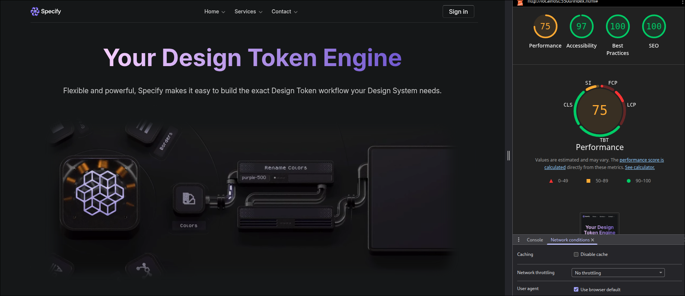

> [!IMPORTANT]  
> Use a web browser based on **Chromium** for the full experience. Others like **Firefox** or **Safari** don't support all of the css properties used.

# Specify Clone

I tried to clone **[SpecifyApp](https://specifyapp.com/)** for a university project with **good practices and SEO** (performance is kinda bad since the screenshot was took using the live server extension that injects javascript into the client).

**for educational purposes.**

_(PLEASE GO TO THE [REAL WEBSITE SPECIFYAPP.COM](https://specifyapp.com/) TO BUY THEIR PRODUCT OR ASK SOMETHING ELSE PLEASE DONT COPYRIGHT ME IM NOT SELLING ANYTHING NOR DOING PISHING THIS IS JUST A SILLY PROJECT TO LEARN.)_

- https://specifyapp.com/

> [!NOTE]  
> **_DONE IN 4 DAYS!!!_**
